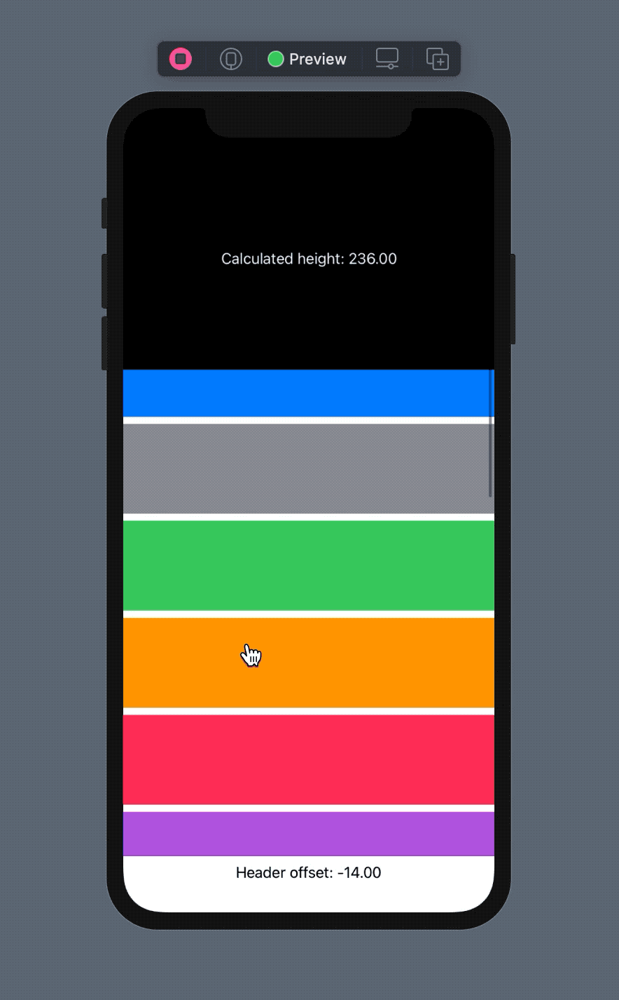
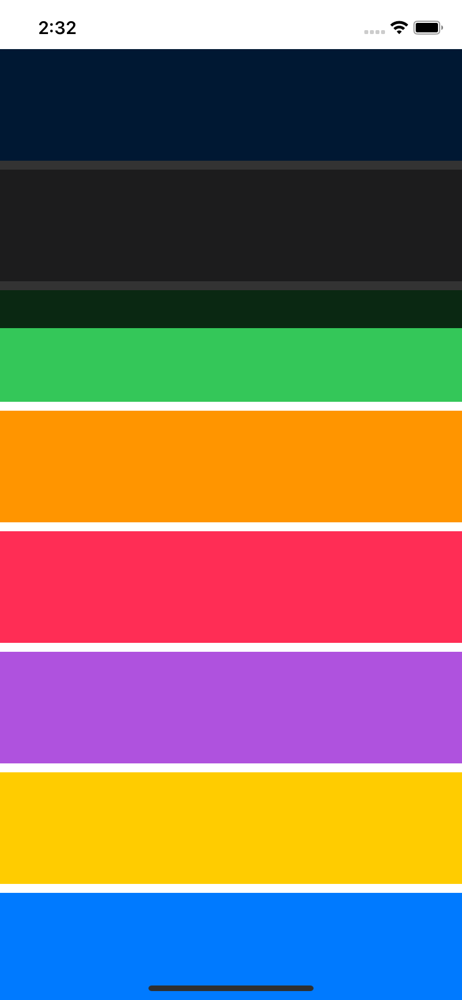

# Offset Demo
In this project I tried to implement a list of scrolling items with a header view which changes its height based on the scroll offset.



## Requirements
This project is using Version 12.0 beta (12A6159).

## Recording The Scroll Offset
I used `GeometryReader` to read the scroll offset. After reading the value, it's reported back using a custom preference:
```swift
struct OffsetPreference: PreferenceKey {
    static var defaultValue: CGFloat?
    static func reduce(value: inout CGFloat?, nextValue: () -> CGFloat?) {
        value = value ?? nextValue()
    }
}

struct OffsetReporter: ViewModifier {
    func body(content: Content) -> some View {
        content.background(
            GeometryReader { proxy in
                Color.clear.preference(key: OffsetPreference.self,
                                       value: proxy.frame(in: .global).minY)
            }
        )
    }
}
```

In the example below, `OffsetReporter` is added to a rectangle. Whenever the frame of the rectangle changes, it reports the `minY` value of the new frame (relative to the global coordinate system).
```swift
struct ContentView: View {
    @State private var headerOffset: CGFloat = .zero
    
    var body: some View {
        VStack {
            ScrollView {
                VStack {
                    Rectangle()
                        .modifier(OffsetReporter())
                }
                .onPreferenceChange(OffsetPreference.self) { value in
                    headerOffset = value ?? .zero
                }
            }
            Spacer()
            Text("Header offset: \(headerOffset, specifier: "%.2f")")
        }
    }
}
```

We can now use the `headerOffset` property to influence other views. My goal in this project was to modify the height of a header view. In order to keep track of the header view's height, I indroduced another modifier + preference combination:
```swift
struct HeightPreference: PreferenceKey {
    static var defaultValue: CGFloat?
    static func reduce(value: inout CGFloat?, nextValue: () -> CGFloat?) {
        value = value ?? nextValue()
    }
}

struct HeightReporter: ViewModifier {
    func body(content: Content) -> some View {
        content.background(
            GeometryReader { proxy in
                Color.clear.preference(key: HeightPreference.self,
                                       value: proxy.size.height)
            }
        )
    }
}
```

When `HeightReporter` is added to a view, it will communicate its height via a preference change.

## Workarounds

Since I wanted the header view to overlay the elements in the list, I arranged them in a `ZStack`:
```swift
var body: some View {
    VStack {
        ZStack(alignment: .top) {
            ScrollView {
                VStack {
                    ForEach(colors.indices) { index in
                        Rectangle()
                            .withFill(colors[index],
                                        height: Constants.itemHeight)
                    }
                }
            }
            Rectangle()
                .withFill(.black,
                            height: calculateHeaderHeight(for: headerOffset))
                .animation(.spring())
        }
    }
}
```

When doing this, the header was overlapping the list items by default, which is not the look I was going for:


At first I tried using [alignment guides](https://developer.apple.com/documentation/swiftui/textfield/alignmentguide(_:computevalue:)-zywe), but that ended up pushing the entire scroll view contents down, so I ended up adding an invisible view as the first element of the list (with a height that matches the header view's height):
```swift
ZStack(alignment: .top) {
    ScrollView {
        VStack {
            Rectangle()
                .withFill(.clear, height: Constants.defaultHeaderHeight)
            ForEach(colors.indices) { index in
                Rectangle()
                    .withFill(colors[index], height: Constants.itemHeight)
            }
        }
    }
    Rectangle()
        .withFill(.black, height: calculateHeaderHeight(for: headerOffset))
}
```
This way I could inset the scrollable content by the size of the header view.

## Putting it all together
Now that I had all the necessary information, the end result was just a matter of fine-tuning:
```swift
var body: some View {
    VStack {
        ZStack(alignment: .top) {
            ScrollView {
                VStack {
                    Rectangle()
                        .withFill(.clear,
                                    height: Constants.defaultHeaderHeight)
                        .edgesIgnoringSafeArea(.top)
                        .modifier(HeightReporter())
                        .modifier(OffsetReporter())
                    ForEach(colors.indices) { index in
                        Rectangle()
                            .withFill(colors[index],
                                        height: Constants.itemHeight)
                    }
                }
                .onPreferenceChange(HeightPreference.self) { value in
                    headerHeight = value
                }
                .onPreferenceChange(OffsetPreference.self) { value in
                    headerOffset = value ?? .zero
                }
            }
            Rectangle()
                .withFill(.black,
                            height: calculateHeaderHeight(for: headerOffset))
                .animation(.spring())
        }
    }
}
```

The code above will record the scroll offset by adding `OffsetReporter` to the first element, and will update the header's size in preference change handlers.